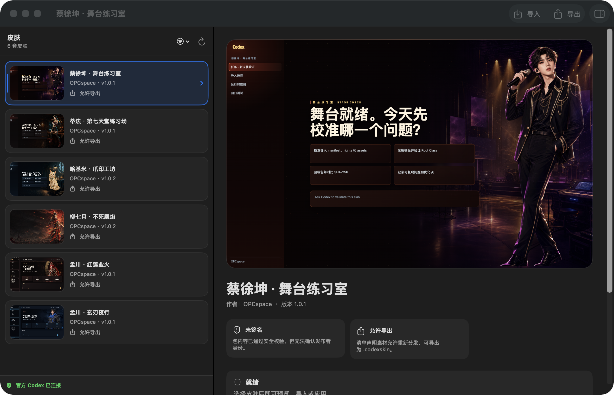

# Codex Skin Manager

一款原生 macOS Codex 皮肤管理器，支持安全导入、预览、切换、重新应用、恢复和受权导出 `.codexskin` 包。

当前管理器已验证可使用三套皮肤：

- 孟川 · 红莲业火：公开非商用同人皮肤。
- 孟川 · 玄刃夜行：公开非商用同人皮肤。
- 柳七月 · 不死凰焰：仅限本机私用的迁移皮肤。

GitHub Release 只公开前两套。柳七月素材授权不允许公开再分发，因此不会放入仓库、内置资源或 GitHub Release；源码版 `1.1.0` 提供本机私有迁移工具。

> 本项目为非官方本地工具，与 OpenAI 或《沧元图》官方无隶属或背书关系。内置素材只允许按各自 `LICENSES/assets.txt` 随皮肤包进行非商用公开分发；这不授予任何角色、作品名、商标或其他第三方权利。



## 主要能力

- 原生 SwiftUI 双栏工作区：左侧直接选择皮肤，右侧集中预览、安全判断和应用操作。
- 筛选收进皮肤列表顶部菜单，不再单独占一整列；列表会同时显示皮肤总数、版本、授权和最近使用状态。
- 右侧详情可收起、展开和调整宽度；收起后资料库会自动切换为完整画廊，而不是留下无效空白。
- `.codexskin` 数据包导入、完整性校验与安全安装。
- 仅允许管理器签名内置的 CSS 模板；包内脚本、CSS、二进制、远程 URL、符号链接和路径穿越会被拒绝。
- 只连接 `127.0.0.1:9340`，并检查监听端口属于官方 Codex 进程。
- 不修改或重签名 `/Applications/ChatGPT.app`，也不会强制结束 Codex。
- 区分“上次使用记录”和本次已经运行时校验的“已验证生效”。
- 同一皮肤只显示一张卡片；同时安装多个版本时自动展示最高语义版本，不再把升级前后的版本重复算作不同皮肤。
- 同一皮肤可重新应用；失败时可直接重试或打开注入日志。
- 恢复默认后无需重启 Codex，即可再次应用任一皮肤。

## 环境要求

直接使用 Release：

- macOS 13 或更高版本
- 官方 Codex 桌面应用安装在 `/Applications/ChatGPT.app`

从源码构建或运行自动化测试：

- macOS 13 或更高版本
- Swift 6 工具链
- Node.js 与 npm
- Google Chrome，或通过 `PLAYWRIGHT_CHROMIUM_EXECUTABLE_PATH` 指定 Chromium（仅浏览器自动化测试需要）

## 直接下载

前往 [GitHub Releases](https://github.com/LouisDM/CodexSkinManager/releases) 下载：

- `Codex-Skin-Manager-v1.0.1-macOS.zip`：管理器应用，已内置两套皮肤。
- `Meng-Chuan-Nightblade-1.0.1.codexskin`：孟川 · 玄刃夜行。
- `Meng-Chuan-Red-Lotus-1.0.1.codexskin`：孟川 · 红莲业火。
- `SHA256SUMS.txt`：下载文件完整性校验。

解压管理器并移动到 `~/Applications`。应用目前使用 ad-hoc 本地签名而非 Apple Developer ID 公证；首次打开如被 macOS 阻止，请在 Finder 中右键应用并选择“打开”。安装管理器后，双击下载的 `.codexskin` 即可导入，也可以直接使用应用内置版本。

## 旧启动器皮肤迁移（本机私有）

`.command` 是启动脚本，不能直接导入管理器。若本机已有“柳七月 · 不死凰焰”旧启动器资源，可先构建安全的数据包：

```bash
python3 scripts/build_private_liu_qiyue_skin.py \
  --runtime "$HOME/Library/Application Support/CodexLiuQiyueUndyingPhoenixSkin/runtime" \
  --output "$HOME/Applications/Liu-Qiyue-Undying-Phoenix-1.0.0.codexskin"
```

然后双击输出文件，或在管理器中按 `⌘O` 导入。转换器只打包两张 PNG、`theme.json`、`rights.json` 和许可文本，不会打包或执行旧启动器中的脚本和 CSS。输出包是本机私用版本，管理器会禁用公开导出。

## 用 Codex 制作新皮肤

不熟悉包格式也可以直接开始。推荐在 [CodexUI](https://github.com/opcspace/CodexUI) 仓库中打开 Codex，然后发送：

```text
查看 codex-cdp-skin-launcher.md，制作《沧元图》柳七月的 Codex 皮肤，先给我 3 个风格差异明显的方案选择。
```

选择后继续回复：

```text
我选 A。参考官方造型特征，生成无水印原创同人素材，直接制作成可导入 Codex 皮肤管理器的 .codexskin，并完成宽窄屏和自动化测试。
```

如果只克隆了本仓库，也可以说：

```text
查看 docs/skin-manager/AUTHORING.md，为柳七月创建一套 .codexskin。先给我 3 个方案；我确认后再创建 skin.json、assets 和 LICENSES，打包并测试导入。
```

用户要求提交、push、PR 或 Release 时，Codex 应同时上传对应皮肤的源文件和宽窄屏截图；权利允许时再上传 `.codexskin` 与 SHA-256。受限素材或权利不明素材不能进入公开 GitHub。

完整的角色研究、方案选择、素材制作和交付提示词见 [Codex macOS 皮肤制作与管理器导入指南](https://github.com/opcspace/CodexUI/blob/main/docs/codex-cdp-skin-launcher.md)。底层字段与安全契约见 [`.codexskin` 制作规范](docs/skin-manager/AUTHORING.md)。

### 手动打包

新皮肤不需要先创建 `.command`、独立端口或注入运行时。准备一个包含 `skin.json`、图片和 `LICENSES/*.txt` 的源目录，然后直接生成管理器格式：

```bash
npm run build:skin -- \
  --source "/绝对路径/my-skin" \
  --output "/绝对路径/my-skin-1.0.0.codexskin"
```

打包器会生成 manifest、文件哈希和确定性 store-only ZIP，并排除 CSS、JavaScript、Shell 和其他主动内容。完整字段、模板、令牌、新模板与旧启动器迁移说明见 [`.codexskin` 制作规范](docs/skin-manager/AUTHORING.md)。

## 转换已有的其他格式皮肤

如果用户已经有自己的皮肤，但它是 `.command`、CSS+图片目录、ZIP、旧主题 JSON 或复制出来的运行时，使用 CodexUI 仓库提供的 [`$convert-to-codexskin`](https://github.com/opcspace/CodexUI/tree/main/skills/convert-to-codexskin) Skill。

提示词：

```text
使用 $convert-to-codexskin，把“/我的皮肤路径”转换为 Codex Skin Manager 可导入的 .codexskin。先只读检查，不执行任何旧脚本；先告诉我可复用素材、需要转换的图片、模板映射、权利缺口和会被排除的文件，我确认后再打包、导入和测试。
```

Skill 会先识别输入：

- PNG/JPEG 和旧 JSON 可映射到新的声明式源目录；
- WebP/GIF/SVG/HEIC 需要保留原件并生成 PNG/JPEG 衍生素材；
- CSS 只作为视觉参考，不能放进皮肤包；
- `.command`、Shell、JavaScript、Python 和二进制只读清点，绝不执行；
- ZIP 只在内存中检查，不解压到仓库；
- 没有明确许可的素材只能生成不可公开分发的本地版本。

任意旧 CSS 无法安全地自动原样导入。现有模板无法表达布局时，需要新增管理器模板并完成测试，而不是关闭包校验。完整转换方法见 [制作指南的非 `.codexskin` 转换章节](https://github.com/opcspace/CodexUI/blob/main/docs/codex-cdp-skin-launcher.md#9-已有非-codexskin-皮肤的转换)。

## 构建与安装

```bash
git clone https://github.com/LouisDM/CodexSkinManager.git
cd CodexSkinManager
npm install
python3 scripts/build_codex_skin_manager_app.py --install
```

应用会被原子安装到：

```text
~/Applications/Codex 皮肤管理器.app
```

首次切换时，如果 Codex 正以普通模式运行，管理器会等待你在 Codex 中按 `⌘Q`，然后以仅绑定本机回环地址的调试会话重新启动官方应用。

快捷键：

- `⌘O`：导入皮肤
- `⌘↩`：切换、重新应用或重试
- `⇧⌘R`：恢复默认
- `⌥⌘I`：收起或显示右侧皮肤详情

日常使用时，直接在左侧点选皮肤并在右侧确认预览与权利信息；需要同时比较多套皮肤时，用 `⌥⌘I` 收起详情进入画廊。顶部筛选菜单仍提供“全部皮肤、最近使用、仅限本机、未验证来源”四种视图。

## 自动化测试

```bash
npm test
npm run test:bundle
npm run test:e2e
npm run build:release
```

完整测试覆盖 Swift 核心、皮肤包安全策略、真实 Chrome CDP 注入、模板切换、恢复后重新应用、应用包签名和隔离启动。`test:e2e` 使用已经安装的应用，但使用临时资料库，不会修改真实皮肤状态。

## 项目结构

- `skin-manager/`：Swift Package、SwiftUI 应用、核心库与单元测试。
- `scripts/`：应用构建、签名和原子安装脚本。
- `scripts/build_codexskin.py`：从声明式源目录生成可直接导入的确定性 `.codexskin`。
- `scripts/build_release_assets.py`：使用核心导出器生成版本化 Release 资产和 SHA-256 清单。
- `tests/`：资源、浏览器/CDP、应用包和隔离启动验收。
- `docs/skin-manager/AUTHORING.md`：新皮肤的数据契约、打包、导入和模板扩展流程。
- `docs/skin-manager/PRODUCT_PRINCIPLES.md`：产品判断与体验原则。
- `docs/skin-manager/ARCHITECTURE.md`：安全边界、切换流程和模板契约。
- `.ai-context/当前进度.md`：跨设备 AI 接手时应首先读取的当前状态。
- `AGENTS.md`：Codex、Cursor 等 AI 工具的通用上下文入口。

## 状态与日志

运行数据位于：

```text
~/Library/Application Support/CodexSkinManager/
```

- `active.json`：最近一次成功应用的持久记录，不代表当前页面一定仍然加载皮肤。
- `runtime/injector.log`：页面注入与守护进程日志。
- UI 显示“皮肤已验证生效”时，代表本次管理器进程已经完成注入与运行时模板校验。

## 设计与维护

产品方向不是复制某个“世界最好产品”的外观，而是采用 Apple 的可预测与可逆、Raycast 的低摩擦任务路径，以及 VS Code 的预览后确认思维。详见 [产品原则](docs/skin-manager/PRODUCT_PRINCIPLES.md)。

代码采用 MIT License。内置皮肤素材不属于 MIT 代码许可；它们只允许在保留各自 `LICENSES/assets.txt` 的前提下，随本皮肤包进行非商用公开分发。相关角色、作品名、商标和其他第三方权利仍归各自权利人所有。
