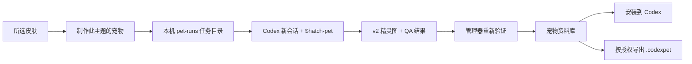

# Codex Theme Pet Workshop Implementation Plan

> **For Claude:** Use `${SUPERPOWERS_SKILLS_ROOT}/skills/collaboration/executing-plans/SKILL.md` to implement this plan task-by-task.

**Goal:** 在现有 Codex Skin Manager 中加入“主题宠物”能力：从当前皮肤创建可交给 Codex 生成的宠物任务，安全导入、预览、安装和卸载 Codex v2 宠物，并按素材授权导出可分享的 `.codexpet` 文件。

**Architecture:** 保留现有 `SkinCore + SwiftUI App` 分层，在 `SkinCore` 内增加独立 Pet 领域模型、v2 精灵图校验器、`.codexpet` 仓库、确定性导入导出器和 Codex 宠物安装器。App 不保存 API Key、不直接调用图片生成服务，也不依赖未公开的 Codex CDP/内部接口；它把当前皮肤的安全副本、配色和用户意图写入本机任务目录，再让新 Codex 会话使用 `$hatch-pet` 完成生成与 QA。App 回到前台后重新验证产物，再纳入宠物库并安装到 `${CODEX_HOME:-$HOME/.codex}/pets/<pet-id>/`。

**Tech Stack:** Swift 6、SwiftUI/AppKit、Foundation、ImageIO/CoreGraphics、CryptoKit、XCTest、Python 3/Pillow 合成测试夹具、现有 store-only ZIP 实现、Codex `$hatch-pet` v2 契约。

---

## 新会话直接使用的开工提示词

```text
查看 AGENTS.md、.ai-context/当前进度.md、.ai-context/长期知识.md、.ai-context/个人偏好.md，
然后严格执行 docs/plans/2026-07-17-codex-theme-pet-workshop.md。

先确认当前功能分支是否已经合并到 main；不要丢失现有 1.1.0 的三套皮肤、双栏布局、
导入导出、左下角账号避让和私有素材规则。按计划逐任务使用 TDD，每完成一个任务运行
对应测试并提交。宠物必须遵守 Codex v2 8×11 精灵图契约；生成环节使用 $hatch-pet，
App 内不得嵌入 API Key、执行第三方脚本或使用未公开的 Codex 内部接口。
完成后运行完整自动化测试、构建并安装到 ~/Applications，再做真实 App 与临时 CODEX_HOME 验收。
```

## 1. 产品结论

### 1.1 用户真正要完成的任务

用户不需要理解精灵图、`pet.json` 或目录结构。主路径只保留五个动作：

1. 在皮肤详情中点击“制作此主题的宠物”。
2. 填写宠物名称、性格和少量动作偏好。
3. App 生成任务并引导用户在 Codex 新会话中开始制作。
4. 制作完成后回到 App，自动发现并验证结果。
5. 在 App 中预览、安装到 Codex；授权允许时导出 `.codexpet`。

### 1.2 交互命名

- 对皮肤继续使用“应用皮肤”，因为它会改变当前 Codex 页面。
- 对宠物使用“安装到 Codex / 从 Codex 移除”，不使用“应用宠物”。
- 安装成功只表示文件已安全写入 Codex 宠物目录，不冒充“当前宠物已激活”。
- 如果当前 Codex 版本需要重新打开窗口或重新启动才能发现新宠物，明确显示实际步骤。
- `.codexpet` 是本管理器定义的安全传输格式，不宣称为 OpenAI 官方格式。

### 1.3 MVP 范围

- 顶层增加“皮肤 / 宠物”内容切换，不新增第三层常驻侧栏。
- 从所选皮肤发起“主题宠物”制作任务。
- 从 `.codexpet` 导入宠物。
- 从 `$hatch-pet` 的本机结果目录收取宠物。
- 从已存在的 `pet.json + spritesheet.webp` 文件夹导入 Codex v2 宠物。
- 列表卡片、详情页和动画状态预览。
- 安装、升级、移除 Codex 宠物。
- 权利允许时确定性导出 `.codexpet`。
- 使用临时 `CODEX_HOME` 完成不污染用户真实目录的端到端测试。

### 1.4 暂不进入 MVP

- App 内直接调用 OpenAI/Image API。
- App 代替用户自动创建或操控 Codex 会话。
- 依赖 Codex `app.asar` 私有函数、DOM 或 CDP 来切换当前宠物。
- 云端宠物市场、账号系统、同步服务和在线评分。
- 自动把私有或权利不明的皮肤衍生宠物发布到 GitHub。
- 自动把 Codex v1 宠物“拉伸”成 v2；v1 升级必须重新生成缺失动作和 16 个观察方向。

## 2. 完整体验流



### 2.1 “当前主题”的明确规则

- 从皮肤详情按钮进入时，来源永远是当前所选皮肤，按钮文案为“制作此主题的宠物”。
- 从宠物页空状态进入时，优先使用本次已验证生效的皮肤；没有时使用当前所选皮肤。
- 创建向导必须显示来源名称、版本和“已验证生效 / 当前选中”状态，避免用户误以为使用了另一套皮肤。
- 只提取已通过 `.codexskin` 安全导入器净化过的本地图片、主题令牌和普通文本；不读取或执行皮肤包外内容。

### 2.2 生成交接

App 创建：

```text
~/Library/Application Support/CodexSkinManager/pet-runs/<request-id>/
├── request.json
├── handoff.md
├── status.json
├── references/
│   ├── avatar.png        # 仅存在时复制
│   ├── hero.png          # 仅存在时复制
│   └── background.png    # 仅存在时复制
└── result/
```

约束：

- 任务目录权限只允许当前用户读取。
- 引用素材是管理器库中已净化文件的副本，不创建指向外部位置的符号链接。
- `request.json` 不包含绝对源路径、密钥、Cookie、邮箱或其他无关个人信息。
- `handoff.md` 是固定模板，用户输入和第三方元数据只作为引用数据，不允许覆盖安全要求。
- App 把 `handoff.md` 内容复制到剪贴板并打开 Codex；用户在新会话粘贴。
- App 回到前台时检查 `result/completion.json`，但该标记只是“有结果可检查”，不能跳过本地验证。

### 2.3 建议的向导

1. **来源**：展示皮肤缩略图、名称、版本、配色和素材授权摘要。
2. **身份**：宠物名称、ID、简介、性格；ID 从名称生成后允许修改。
3. **动作偏好**：灵动、沉稳、凶猛、治愈四个预设加自由备注，不让用户逐帧配置。
4. **权利**：默认“仅限本机”；只有来源皮肤允许再分发且用户确认新生成素材权利时，才允许选择“可导出分享”。
5. **开始制作**：显示“复制制作指令并打开 Codex”，以及返回 App 后的下一步。

## 3. Codex v2 宠物硬契约

新制作和新导入的宠物必须全部满足：

- `spriteVersionNumber: 2`
- WebP 或 PNG 可解码；管理器自己的 `.codexpet` v1 固定使用 `spritesheet.webp`
- 最终尺寸 `1536 × 2288`
- 网格 `8 列 × 11 行`
- 单元格 `192 × 208`
- 透明背景
- 第 9、10 行包含固定顺序的 16 个观察方向
- 未使用单元格必须全透明

标准动作行：

| 行 | 状态 | 使用列 |
|---:|---|---|
| 0 | idle | 0–5 |
| 1 | running-right | 0–7 |
| 2 | running-left | 0–7 |
| 3 | waving | 0–3 |
| 4 | jumping | 0–4 |
| 5 | failed | 0–7 |
| 6 | waiting | 0–5 |
| 7 | running | 0–5 |
| 8 | review | 0–5 |
| 9 | 000°–157.5° | 0–7 |
| 10 | 180°–337.5° | 0–7 |

观察方向顺序：

```text
000, 022.5, 045, 067.5, 090, 112.5, 135, 157.5,
180, 202.5, 225, 247.5, 270, 292.5, 315, 337.5
```

`000` 表示向上，不是正面静止。整个图集共 88 个单元格，其中 73 个必须有内容，15 个必须全透明。

管理器负责结构校验；动作自然度、角色一致性、方向语义和修复策略仍由 `$hatch-pet` QA 完成。管理器不能因为看到 `qa/run-summary.json` 的 “pass” 就信任未经解码验证的图片。

## 4. `.codexpet` v1 包格式

### 4.1 文件树

```text
my-pet-1.0.0.codexpet
├── manifest.json
├── rights.json
├── spritesheet.webp
├── LICENSES/
│   └── assets.txt
└── signature.ed25519      # 可选
```

不单独存储列表主图。App 总是从 `spritesheet.webp` 的 idle 第 0 帧生成缩略图与静态预览，从根源上保证“主图就是实际宠物”。

### 4.2 Manifest 示例

```json
{
  "schemaVersion": 1,
  "kind": "codex-pet",
  "id": "meng-chuan-nightblade-pet",
  "displayName": "玄刃夜行·影兽",
  "version": "1.0.0",
  "description": "一只带有深蓝刀光气息的灵动影兽。",
  "minManagerVersion": "1.2.0",
  "spriteVersionNumber": 2,
  "spritesheetPath": "spritesheet.webp",
  "sourceTheme": {
    "skinID": "meng-chuan-nightblade",
    "skinVersion": "1.0.1",
    "skinName": "孟川 · 玄刃夜行",
    "template": "nightblade-v1",
    "contentFingerprint": "<sha256>"
  },
  "files": [
    {
      "path": "rights.json",
      "byteCount": 233,
      "sha256": "<sha256>",
      "mime": "application/json"
    },
    {
      "path": "spritesheet.webp",
      "byteCount": 1234567,
      "sha256": "<sha256>",
      "mime": "image/webp"
    },
    {
      "path": "LICENSES/assets.txt",
      "byteCount": 456,
      "sha256": "<sha256>",
      "mime": "text/plain"
    }
  ],
  "author": {
    "name": "OPCspace",
    "website": null
  },
  "publisherPublicKey": null
}
```

### 4.3 Rights 示例

```json
{
  "redistributionAllowed": false,
  "commercialUse": false,
  "sourceRightsConfirmed": false,
  "fanMade": true,
  "unofficial": true,
  "noEndorsement": true,
  "notice": "仅限本机私用；来源皮肤及生成素材未获得公开再分发授权。"
}
```

导出条件必须同时满足：

```text
redistributionAllowed == true
AND sourceRightsConfirmed == true
```

来源皮肤不允许导出时，衍生宠物必须默认本机私用。即使用户手动修改任务目录，最终导入仍根据包内权利和来源快照显示风险；公开 Git/Release 流程必须再次做许可检查。

### 4.4 安全边界

- 只接受 store-only ZIP、UTF-8 NFC 相对路径和普通文件。
- 拒绝绝对路径、`..`、反斜杠、NUL、重复/大小写折叠冲突、符号链接、特殊文件、加密项、压缩项和嵌套压缩包。
- 总包不超过 64 MiB；单文件不超过 32 MiB；最多 128 个文件。
- 只允许根 `manifest.json`、`rights.json`、`spritesheet.webp`、`LICENSES/*.txt` 和可选根 `signature.ed25519`。
- 不允许 JavaScript、CSS、Shell、Python、可执行文件、字体、SVG、远程 URL 或任意 Codex 配置。
- 清单中的长度、SHA-256、MIME 和实际解码结果必须全部一致。
- 签名沿用皮肤包的 Ed25519 信任模型；没有签名可以本机导入，但明确显示“未签名”。
- 不直接信任包内 `pet.json`。安装时由管理器根据已验证模型生成最小 Codex `pet.json`。

## 5. 本机存储和安装模型

管理器状态：

```text
~/Library/Application Support/CodexSkinManager/
├── skins/
├── pets/<id>/<version>/
├── pet-installations/<id>.json
├── pet-runs/<request-id>/
└── .staging/
```

Codex 运行目录：

```text
${CODEX_HOME:-$HOME/.codex}/pets/<pet-id>/
├── pet.json
└── spritesheet.webp
```

安装规则：

- `CODEX_HOME` 存在时优先使用；否则使用 `~/.codex`。
- 所有测试注入临时 `CODEX_HOME`，禁止碰真实 `~/.codex/pets`。
- 写入同卷 staging 目录，完整写完、校验和同步后再原子替换。
- 目标 ID 已存在且不是管理器安装时，拒绝覆盖，并提示“导入现有宠物”或修改 ID。
- 管理器升级自己安装的宠物前，先核对安装回执中的文件哈希；用户手动改过时拒绝覆盖。
- 卸载前同样核对哈希；只删除管理器明确拥有且未被外部修改的两个文件。
- 不在 Codex 宠物目录写管理器回执、日志或临时文件。

安装状态：

| 状态 | 含义 | 主要操作 |
|---|---|---|
| 未安装 | 仅在管理器宠物库 | 安装到 Codex |
| 已安装 | 版本和哈希一致 | 从 Codex 移除 |
| 有更新 | 同 ID 的管理器版本更高 | 更新安装 |
| 外部冲突 | 目标存在但非管理器拥有或已修改 | 查看冲突 / 改 ID |

生成的 Codex `pet.json` 固定为：

```json
{
  "id": "pet-id",
  "displayName": "Pet Name",
  "description": "One short sentence.",
  "spriteVersionNumber": 2,
  "spritesheetPath": "spritesheet.webp"
}
```

## 6. SwiftUI 信息架构

### 6.1 顶层

- 窗口标题仍保留“Codex 皮肤管理器”，MVP 不做品牌改名。
- 标题栏中增加紧凑分段选择器：`皮肤 | 宠物`。
- 切换内容类型后，资料库、详情和顶部文件操作一起切换；不保留无效的皮肤筛选。
- 文件操作保持成组：
  - 皮肤页：导入 `.codexskin` / 导出 `.codexskin`
  - 宠物页：导入 `.codexpet` / 导出 `.codexpet`
- 拖入文件时根据扩展名自动切换到对应内容页并导入。

### 6.2 宠物资料库

- 紧凑列表显示真实 idle 首帧、名称、版本、来源主题、签名和安装状态。
- 详情收起时切换为响应式画廊，复用皮肤页已经验证过的双栏/画廊逻辑。
- 同一宠物 ID 默认只显示最高语义版本，旧版本保留在仓库但不制造重复卡片。
- 筛选只保留有任务价值的四项：全部、已安装、有更新、仅限本机。

### 6.3 宠物详情

- 顶部展示透明棋盘背景上的真实 sprite 动画。
- 状态选择：待机、右跑、左跑、招手、跳跃、失败、等待、奔跑、审查、观察方向。
- 正常播放默认 8–12 FPS；“减少动态效果”时只显示每个状态第 0 帧。
- 图片只解码一次并缓存 `CGImage`；时间轴只裁切单元格，不能每帧重新解码 WebP。
- 主要按钮：安装到 Codex / 更新安装 / 从 Codex 移除。
- 次要信息：来源主题、作者、版本、包信任、权利、文件位置。
- 错误必须说明是包无效、Codex 目录冲突、版本未刷新还是授权不允许导出。

## 7. 核心数据模型草案

```swift
public struct PetManifest: Codable, Equatable, Sendable {
    public let schemaVersion: Int
    public let kind: String
    public let id: String
    public let displayName: String
    public let version: String
    public let description: String
    public let minManagerVersion: String
    public let spriteVersionNumber: Int
    public let spritesheetPath: String
    public let sourceTheme: PetSourceTheme?
    public let files: [PetFile]
    public let author: PetAuthor
    public let publisherPublicKey: String?
}

public struct PetAtlasContract: Sendable {
    public static let columns = 8
    public static let rows = 11
    public static let cellWidth = 192
    public static let cellHeight = 208
    public static let width = 1536
    public static let height = 2288
    public static let frameCounts = [6, 8, 8, 4, 5, 8, 6, 6, 6, 8, 8]
}

public struct PetCreationRequest: Codable, Equatable, Sendable {
    public let schemaVersion: Int
    public let requestID: UUID
    public let createdAt: Date
    public let sourceTheme: PetCreationSource
    public let identity: PetCreationIdentity
    public let motionPreset: PetMotionPreset
    public let userNotes: String
    public let references: [PetCreationReference]
    public let output: PetCreationOutputContract
}
```

实施时不要为了“抽象漂亮”一次性重命名全部现有 `Skin*` 类型。只提取真正共享且已有测试保护的基础设施，例如 `StoredZipWriter`、哈希和安全相对路径；Pet 模型保持独立，降低对稳定皮肤功能的回归风险。

## 8. 分阶段实施

### Phase A：可安全管理宠物

完成 `.codexpet` 契约、结构校验、仓库、导入导出、Codex 安装器和动画预览。此阶段不依赖生成。

### Phase B：从当前主题制作

完成创建向导、任务目录、固定 handoff、`$hatch-pet` 结果接收和权利确认。

### Phase C：迁移和体验增强

发现现有 `~/.codex/pets`、导入 v2 文件夹、为 v1 宠物生成升级任务、加入更顺滑的任务进度和未来官方会话接口适配层。

---

## 9. 逐任务实施计划

### Task 0: 建立安全基线和独立分支

**Files:**
- Read: `AGENTS.md`
- Read: `.ai-context/当前进度.md`
- Read: `.ai-context/长期知识.md`
- Read: `.ai-context/个人偏好.md`
- Read: `docs/skin-manager/ARCHITECTURE.md`
- Read: `docs/skin-manager/PRODUCT_PRINCIPLES.md`
- Read: `docs/plans/2026-07-17-codex-theme-pet-workshop.md`

**Step 1: 确认基线分支**

Run:

```bash
git fetch origin
git status --short --branch
git rev-list --left-right --count origin/main...HEAD
```

Expected:

- 工作树没有不明改动。
- 当前仓库的宠物开发基线必须包含 `34b83b3` 或其后继提交所代表的 1.1.0 功能。
- 如果 `codex/undying-phoenix-private-import` 尚未合并到 `main`，先停下确认正确合并方式；不要从缺少 11 个提交的旧 `main` 直接开发。

**Step 2: 创建功能分支**

Run:

```bash
git switch -c codex/theme-pet-workshop
npm install
npm test
```

Expected: 现有 72 个 Swift 测试、6 个 Chrome/CDP 测试和所有 Python 契约测试通过。

**Step 3: 核对隐私**

Run:

```bash
git ls-files | rg 'Liu-Qiyue|liu-qiyue|hero-character|hero-background'
```

Expected: 不出现受限 PNG、私有 `.codexskin` 或生成宠物素材。通用代码和文档可以存在。

### Task 1: 锁定 v2 契约并验证 macOS WebP 能力

**Files:**
- Create: `docs/skin-manager/PET_CONTRACT.md`
- Create: `skin-manager/Sources/SkinCore/PetAtlasContract.swift`
- Create: `skin-manager/Tests/SkinCoreTests/PetAtlasContractTests.swift`
- Create: `tests/fixtures/build_synthetic_pet_fixture.py`
- Create: `skin-manager/Tests/SkinCoreTests/Fixtures/pet-v2-synthetic.webp`

**Step 1: 先写失败测试**

测试必须覆盖：

- 常量为 `1536 × 2288`、`8 × 11`、`192 × 208`。
- 帧数为 `[6, 8, 8, 4, 5, 8, 6, 6, 6, 8, 8]`。
- 73 个使用单元格、15 个未使用单元格。
- 合成 WebP 可被目标 macOS 的 ImageIO 解码。
- 正确夹具通过；错误尺寸、空的使用单元格、非空未使用单元格失败。

示例：

```swift
func testV2FixtureHasExactGeometryAndOccupancy() throws {
    let data = try fixtureData("pet-v2-synthetic.webp")
    let result = try PetAtlasValidator().validate(data: data)

    XCTAssertEqual(result.pixelWidth, 1536)
    XCTAssertEqual(result.pixelHeight, 2288)
    XCTAssertEqual(result.nonEmptyCellCount, 73)
    XCTAssertEqual(result.emptyCellCount, 15)
}
```

**Step 2: 验证 RED**

Run:

```bash
cd skin-manager
swift test --filter PetAtlasContractTests
```

Expected: FAIL，因为契约和验证器尚不存在。

**Step 3: 生成无版权测试夹具**

Python 夹具只画程序化彩色几何形状和方向标记，不使用任何角色或私有皮肤素材。未使用单元格保持 RGBA 全零。

Run:

```bash
python3 tests/fixtures/build_synthetic_pet_fixture.py
```

Expected: 生成固定尺寸 WebP；重复运行得到相同像素内容。

**Step 4: 实现最小校验器**

使用 ImageIO 解码到受控 RGBA 缓冲区：

- 核对格式和尺寸。
- 逐单元格统计 alpha 非零像素。
- 使用单元格至少存在可见像素。
- 未使用单元格 alpha 必须全部为零。
- 只做结构判断，不把“看起来像正确动作”伪装成机器可证明的结论。

如果 macOS 13 的 ImageIO 无法稳定解码 WebP，停止后续实现并记录证据，再决定是否引入经过审计的 libwebp；不得默默改用私有 API。

**Step 5: GREEN 并提交**

Run:

```bash
cd skin-manager
swift test --filter PetAtlasContractTests
```

Expected: PASS。

Commit:

```bash
git add docs/skin-manager/PET_CONTRACT.md skin-manager/Sources/SkinCore/PetAtlasContract.swift skin-manager/Tests/SkinCoreTests/PetAtlasContractTests.swift tests/fixtures/build_synthetic_pet_fixture.py skin-manager/Tests/SkinCoreTests/Fixtures/pet-v2-synthetic.webp
git commit -m "feat: define codex v2 pet contract"
```

### Task 2: 定义 `.codexpet` 数据模型和权利规则

**Files:**
- Create: `skin-manager/Sources/SkinCore/PetPackageModels.swift`
- Create: `skin-manager/Tests/SkinCoreTests/PetPackageModelsTests.swift`
- Modify: `docs/skin-manager/PET_CONTRACT.md`

**Step 1: 写模型失败测试**

覆盖：

- `kind` 必须为 `codex-pet`。
- schema 只接受 `1`。
- ID、SemVer 和 `minManagerVersion` 使用与皮肤相同的安全约束。
- `spriteVersionNumber` 只能为 `2`。
- `spritesheetPath` 固定为 `spritesheet.webp`。
- 只允许 `image/webp`、`application/json`、`text/plain`。
- 必须声明 `rights.json`、`spritesheet.webp`、至少一个 `LICENSES/*.txt`。
- 描述、作者、来源主题和哈希有长度上限。
- `PetRights.canExportPublicly` 必须同时检查再分发许可和来源权利确认。

**Step 2: 验证 RED**

Run:

```bash
cd skin-manager
swift test --filter PetPackageModelsTests
```

Expected: FAIL。

**Step 3: 实现模型和验证**

新增 `PetManifest`、`PetFile`、`PetAuthor`、`PetSourceTheme`、`PetRights`、`PetPackageContract` 和明确的 `LocalizedError`。不复用 `SkinPackageContract.supportedTemplates`，宠物包不携带模板或代码。

**Step 4: GREEN 并提交**

Run:

```bash
cd skin-manager
swift test --filter PetPackageModelsTests
```

Expected: PASS。

Commit: `feat: define safe codexpet package models`

### Task 3: 提取通用 ZIP 写入器并实现宠物导入器

**Files:**
- Create: `skin-manager/Sources/SkinCore/StoredZipWriter.swift`
- Modify: `skin-manager/Sources/SkinCore/SkinPackageExporter.swift`
- Modify: `skin-manager/Sources/SkinCore/StoredZipArchive.swift`
- Create: `skin-manager/Sources/SkinCore/PetPackageImporter.swift`
- Create: `skin-manager/Tests/SkinCoreTests/StoredZipWriterTests.swift`
- Create: `skin-manager/Tests/SkinCoreTests/PetPackageImporterTests.swift`

**Step 1: 用现有皮肤测试保护提取**

先增加测试，证明提取前后同一皮肤导出字节完全一致。把 `StoredZipWriter` 的错误从 `SkinExportError` 解耦为 `StoredZipWriterError`，在皮肤导出器中映射回原有用户文案。

**Step 2: 写宠物攻击测试**

覆盖：

- 跨目录、符号链接、特殊文件、压缩/加密项、重复路径和 Unicode/大小写冲突。
- `.codexskin` 伪装为 `.codexpet`。
- 缺文件、未声明文件、额外脚本、嵌套 ZIP、MIME/长度/哈希不一致。
- 超出 64 MiB、单文件 32 MiB、128 项限制。
- 无效签名和未知签名状态。
- WebP 无法解码、错误尺寸、使用单元格为空、未使用单元格非空。

**Step 3: 验证 RED**

Run:

```bash
cd skin-manager
swift test --filter 'StoredZipWriterTests|PetPackageImporterTests'
```

Expected: 新测试 FAIL，现有皮肤测试仍 PASS。

**Step 4: 实现导入器**

流程固定为：

1. `StoredZipArchive` 完成 ZIP 层安全校验。
2. 精确核对允许文件集合。
3. 解码原始 manifest 并验证签名。
4. 核对每个文件描述符。
5. 解码 `rights.json`。
6. 使用 `PetAtlasValidator` 验证 WebP。
7. 返回不可变 `ImportedPetPackage`。

宠物 WebP 在完整验证后保留原始字节，不无意义重编码；列表和安装使用同一经过哈希验证的文件。

**Step 5: 完整回归并提交**

Run:

```bash
cd skin-manager
swift test --filter 'StoredZipWriterTests|PetPackageImporterTests|SkinPackageExporterTests|SkinPackageImporterTests'
```

Expected: 全部 PASS，皮肤确定性导出未变化。

Commit: `feat: validate restricted codexpet archives`

### Task 4: 实现版本化宠物仓库

**Files:**
- Create: `skin-manager/Sources/SkinCore/PetRepository.swift`
- Create: `skin-manager/Tests/SkinCoreTests/PetRepositoryTests.swift`

**Step 1: 写失败测试**

覆盖：

- 安装到管理器状态根的 `pets/<id>/<version>`。
- 同 ID/版本/内容重复导入返回 already installed。
- 同 ID/版本但内容不同拒绝冲突。
- staging 失败回滚。
- 清理遗留 staging。
- 哈希损坏后加载失败。
- 多版本排序和每个 ID 最高 SemVer 展示。
- 删除只影响指定版本，不影响皮肤库。

**Step 2: RED**

Run:

```bash
cd skin-manager
swift test --filter PetRepositoryTests
```

Expected: FAIL。

**Step 3: 实现 actor 仓库**

沿用 `SkinRepository` 的原子写入和安装回执原则，但使用独立 `pets` 路径。回执记录原始 manifest 哈希、实际文件哈希和信任状态。

**Step 4: GREEN 并提交**

Run:

```bash
cd skin-manager
swift test --filter PetRepositoryTests
```

Expected: PASS。

Commit: `feat: persist versioned pet packages`

### Task 5: 实现宠物导出器和文件夹导入转换

**Files:**
- Create: `skin-manager/Sources/SkinCore/PetPackageExporter.swift`
- Create: `skin-manager/Sources/SkinCore/CodexPetFolderImporter.swift`
- Create: `skin-manager/Tests/SkinCoreTests/PetPackageExporterTests.swift`
- Create: `skin-manager/Tests/SkinCoreTests/CodexPetFolderImporterTests.swift`

**Step 1: 写导出失败测试**

断言：

- 权利不足时拒绝导出，并返回可读原因。
- 输出使用固定顺序、固定 ZIP 元数据和原始验证 WebP。
- 相同输入重复导出 SHA-256 一致。
- 输出能由 `PetPackageImporter` 回导。
- 包中没有 `pet.json`、QA 中间图、源皮肤引用图或绝对路径。

**Step 2: 写现有文件夹导入测试**

只接受一个普通目录中的：

```text
pet.json
spritesheet.webp
```

要求：

- `pet.json` 精确符合 Codex v2 必要字段。
- 不跟随符号链接。
- 拒绝 v1 或错误尺寸。
- 导入向导补充作者、版本、许可和默认本机私用权利后，再包装成管理器内部包。
- 不执行目录中的任何其他文件。

**Step 3: RED**

Run:

```bash
cd skin-manager
swift test --filter 'PetPackageExporterTests|CodexPetFolderImporterTests'
```

Expected: FAIL。

**Step 4: 实现并 GREEN**

Run:

```bash
cd skin-manager
swift test --filter 'PetPackageExporterTests|CodexPetFolderImporterTests'
```

Expected: PASS。

Commit: `feat: export pets and import codex pet folders`

### Task 6: 实现 Codex 宠物安装器

**Files:**
- Create: `skin-manager/Sources/SkinCore/CodexPetInstaller.swift`
- Create: `skin-manager/Tests/SkinCoreTests/CodexPetInstallerTests.swift`

**Step 1: 写安装安全测试**

使用每个测试独立临时 `CODEX_HOME`，覆盖：

- 首次安装写出精确 `pet.json` 和 `spritesheet.webp`。
- 安装目录以 validated ID 命名。
- 写到一半失败不留下半成品。
- 管理器拥有且哈希一致时允许更新。
- 非管理器目录、符号链接目标和外部修改目标全部拒绝覆盖。
- 卸载只删除回执匹配文件。
- 卸载后保留用户手动增加的未知内容并报冲突，不递归强删。
- 环境变量不存在时才解析默认 `~/.codex`。

**Step 2: RED**

Run:

```bash
cd skin-manager
swift test --filter CodexPetInstallerTests
```

Expected: FAIL。

**Step 3: 实现安装器**

建议接口：

```swift
public actor CodexPetInstaller {
    public init(
        codexHomeURL: URL,
        receiptRootURL: URL,
        fileManager: FileManager = .default
    )

    public func status(for pet: InstalledPet) throws -> PetInstallationStatus
    public func install(_ package: StoredPetPackage) throws -> PetInstallationReceipt
    public func uninstall(id: String) throws
}
```

安装回执留在管理器状态目录，不能污染 `~/.codex/pets`。

**Step 4: GREEN 并提交**

Run:

```bash
cd skin-manager
swift test --filter CodexPetInstallerTests
```

Expected: PASS。

Commit: `feat: install pets safely into codex home`

### Task 7: 构建主题到宠物的本机任务

**Files:**
- Create: `skin-manager/Sources/SkinCore/PetCreationRequest.swift`
- Create: `skin-manager/Sources/SkinCore/PetCreationWorkspace.swift`
- Create: `skin-manager/Sources/SkinCore/PetCreationHandoff.swift`
- Create: `skin-manager/Tests/SkinCoreTests/PetCreationRequestTests.swift`
- Create: `skin-manager/Tests/SkinCoreTests/PetCreationWorkspaceTests.swift`

**Step 1: 写失败测试**

覆盖：

- 从 `StoredSkinPackage` 提取名称、版本、模板、主题令牌和允许的 avatar/hero/background。
- `contentFingerprint` 对相同来源稳定，对任一引用图片变化敏感。
- 只复制管理器库内已验证文件。
- 文件名固定且相对，不泄露原绝对路径。
- 用户输入有长度限制，不能覆盖 handoff 的安全段落。
- 来源 `redistributionAllowed == false` 时，创建任务权利固定为本机私用。
- 任务目录权限和原子创建。

**Step 2: RED**

Run:

```bash
cd skin-manager
swift test --filter 'PetCreationRequestTests|PetCreationWorkspaceTests'
```

Expected: FAIL。

**Step 3: 实现固定 handoff**

`handoff.md` 至少包含：

```text
使用 $hatch-pet 制作 Codex v2 宠物。
先完整读取 request.json，只把 references/ 下图片作为视觉参考。
不得执行任务目录中的脚本，不得访问皮肤包外路径。
最终必须是 1536×2288、8×11、192×208、spriteVersionNumber 2。
完成 $hatch-pet 全部 QA 后，把 pet.json、spritesheet.webp 和 qa/run-summary.json
复制到 result/，最后原子写入 result/completion.json。
不要自行提交、push 或发布任何素材。
```

加入完整 `$hatch-pet` v2 动作、方向、QA 和私有素材约束。这里引用技能契约，不复制技能实现脚本进 App。

**Step 4: GREEN 并提交**

Run:

```bash
cd skin-manager
swift test --filter 'PetCreationRequestTests|PetCreationWorkspaceTests'
```

Expected: PASS。

Commit: `feat: create local theme pet handoffs`

### Task 8: 接收并验证 `$hatch-pet` 结果

**Files:**
- Create: `skin-manager/Sources/SkinCore/PetCreationResultImporter.swift`
- Create: `skin-manager/Tests/SkinCoreTests/PetCreationResultImporterTests.swift`

**Step 1: 写失败测试**

覆盖：

- 没有 completion 标记时状态为进行中。
- completion 标记格式错误时不导入。
- `pet.json` ID 和 request 不一致时拒绝。
- `spritesheet.webp` 必须重新走 `PetAtlasValidator`。
- QA summary 缺失或报错时不自动标记完成。
- QA summary 通过但图片结构错误时仍拒绝。
- 成功结果被包装成 `ImportedPetPackage`，默认权利来自 request，不信任结果目录自行放入的宽松 rights。
- 二次收取具有幂等性。

**Step 2: RED**

Run:

```bash
cd skin-manager
swift test --filter PetCreationResultImporterTests
```

Expected: FAIL。

**Step 3: 实现结果状态**

状态建议：

```swift
enum PetCreationRunState {
    case ready
    case awaitingCodex
    case generating
    case resultAvailable
    case validationFailed(String)
    case imported(PetReference)
}
```

App 每次回到前台和用户点击“检查结果”时扫描，不在 MVP 引入长期后台 watcher。

**Step 4: GREEN 并提交**

Run:

```bash
cd skin-manager
swift test --filter PetCreationResultImporterTests
```

Expected: PASS。

Commit: `feat: receive validated hatch pet results`

### Task 9: 建立宠物展示和动作模型

**Files:**
- Create: `skin-manager/Sources/SkinCore/PetPresentation.swift`
- Create: `skin-manager/Sources/SkinCore/PetAtlasFrameLayout.swift`
- Create: `skin-manager/Tests/SkinCoreTests/PetPresentationTests.swift`
- Create: `skin-manager/Tests/SkinCoreTests/PetAtlasFrameLayoutTests.swift`

**Step 1: 写失败测试**

覆盖：

- 同 ID 只展示最高 SemVer。
- 全部、已安装、有更新、仅限本机筛选。
- 安装、更新、卸载和导出的按钮可用性。
- 信任、权利、冲突和来源主题文案。
- 11 行每一帧的裁切矩形正确，注意 CoreGraphics 坐标与图片顶端行的转换。
- reduced motion 固定使用第 0 帧。

**Step 2: RED**

Run:

```bash
cd skin-manager
swift test --filter 'PetPresentationTests|PetAtlasFrameLayoutTests'
```

Expected: FAIL。

**Step 3: 实现纯展示模型**

所有按钮 enablement、状态文案和危险提示留在可测试模型中，不埋在 SwiftUI `if` 分支里。

**Step 4: GREEN 并提交**

Run:

```bash
cd skin-manager
swift test --filter 'PetPresentationTests|PetAtlasFrameLayoutTests'
```

Expected: PASS。

Commit: `feat: model pet library presentation`

### Task 10: 扩展 AppModel 为皮肤和宠物双内容

**Files:**
- Modify: `skin-manager/Sources/CodexSkinManager/AppModel.swift`
- Create: `skin-manager/Sources/CodexSkinManager/PetSelection.swift`
- Modify: `skin-manager/Tests/SkinCoreTests/AppPresentationTests.swift`

**Step 1: 写 App 状态测试**

新增 `AppSection.skin` 和 `.pet`，断言：

- 切换 section 不清空各自选择。
- 导入后切到正确 section 并选中新内容。
- 宠物安装状态刷新不影响皮肤活动状态。
- 删除宠物前先检查是否已安装。
- 创建任务优先使用明确选中的皮肤来源。
- App bootstrap 中宠物仓库失败不会阻断皮肤库使用，反之亦然。

**Step 2: RED**

Run:

```bash
cd skin-manager
swift test --filter AppPresentationTests
```

Expected: 新断言 FAIL。

**Step 3: 实现状态编排**

把宠物仓库、导入器、导出器和安装器注入 `AppModel`。避免继续让单个 `AppModel.swift` 无限膨胀；宠物命令可放在 `AppModel+Pets.swift`。

**Step 4: GREEN 并提交**

Run:

```bash
cd skin-manager
swift test --filter AppPresentationTests
```

Expected: PASS。

Commit: `feat: add pets to app state`

### Task 11: 实现宠物资料库、动画详情和文件操作

**Files:**
- Modify: `skin-manager/Sources/CodexSkinManager/ContentView.swift`
- Modify: `skin-manager/Sources/CodexSkinManager/SkinFilePanels.swift`
- Create: `skin-manager/Sources/CodexSkinManager/PetLibraryView.swift`
- Create: `skin-manager/Sources/CodexSkinManager/PetDetailView.swift`
- Create: `skin-manager/Sources/CodexSkinManager/PetSpritePlayer.swift`
- Create: `skin-manager/Sources/CodexSkinManager/PetFilePanels.swift`
- Modify: `skin-manager/Sources/CodexSkinManager/CodexSkinManagerApp.swift`
- Modify: `skin-manager/Resources/Info.plist`

**Step 1: 先扩展 UTI 和菜单契约测试**

在包校验测试中断言：

- `com.opcspace.codexpet`
- 扩展名 `codexpet`
- MIME `application/vnd.opcspace.codexpet`
- App 同时声明 `.codexskin` 和 `.codexpet`

**Step 2: 实现顶层 section 和响应式布局**

- 复用现有 `HSplitView` 和详情收起逻辑。
- 标题栏 section 切换不挤压文件操作。
- 小窗口时工具栏允许收进系统 overflow，不强制固定宽度。
- 宠物列表与详情不能重复展示同一张大预览。

**Step 3: 实现动画播放器**

- 背景使用透明棋盘或系统材质。
- `TimelineView` 只改变 frame index。
- 缓存解码图。
- VoiceOver 读出状态和帧，不朗读无意义坐标。
- `accessibilityReduceMotion` 时静止。

**Step 4: 实现动态文件操作**

- `⌘O` 根据所选文件扩展名导入。
- `⇧⌘E` 根据当前 section 导出。
- 拖入 `.codexpet` 自动切换宠物页。
- 文件夹导入放在宠物导入按钮的下拉菜单，不挤出第三个并列按钮。

**Step 5: 构建并提交**

Run:

```bash
cd skin-manager
swift test
swift build
```

Expected: 全部 Swift 测试和构建 PASS。

Commit: `feat: add responsive pet library and preview`

### Task 12: 实现“制作此主题的宠物”向导

**Files:**
- Create: `skin-manager/Sources/CodexSkinManager/PetCreationSheet.swift`
- Create: `skin-manager/Sources/CodexSkinManager/PetCreationRunView.swift`
- Modify: `skin-manager/Sources/CodexSkinManager/SkinDetailView.swift`
- Modify: `skin-manager/Sources/CodexSkinManager/PetDetailView.swift`
- Modify: `skin-manager/Sources/CodexSkinManager/AppModel.swift`

**Step 1: 写向导展示模型测试**

覆盖：

- 名称和 ID 即时校验。
- 来源权利不足时分享选项不可用。
- 没有可用引用图时仍可使用主题配色创建，但要显示提示。
- 任务成功后提供“复制制作指令”“打开 Codex”“在 Finder 显示”“检查结果”。
- 打开 Codex 失败不丢任务目录或剪贴板内容。

**Step 2: 实现向导**

主按钮使用一次明确动作：

```text
复制制作指令并打开 Codex
```

执行：

1. 生成任务目录。
2. 将 handoff 复制到 `NSPasteboard`。
3. 使用 `NSWorkspace` 启动/激活官方 Codex。
4. 显示“请新建会话并粘贴”的简短说明。

不使用 UI 自动化替用户点击，不模拟键盘粘贴。

**Step 3: 实现返回后的结果接收**

监听 App 重新激活事件，刷新运行状态；只有本地完整验证通过后才出现“加入宠物库”。

**Step 4: 验证并提交**

Run:

```bash
cd skin-manager
swift test
swift build
```

Expected: PASS。

Commit: `feat: guide theme pet creation with codex`

### Task 13: 发现现有 Codex 宠物并处理 v1

**Files:**
- Create: `skin-manager/Sources/SkinCore/CodexPetDiscovery.swift`
- Create: `skin-manager/Tests/SkinCoreTests/CodexPetDiscoveryTests.swift`
- Modify: `skin-manager/Sources/CodexSkinManager/PetLibraryView.swift`
- Modify: `skin-manager/Sources/CodexSkinManager/PetDetailView.swift`

**Step 1: 写发现测试**

覆盖：

- 只扫描 `CODEX_HOME/pets/*/pet.json` 的一级普通目录。
- 不跟随符号链接。
- v2 完整宠物标记为可导入。
- 缺少 `spriteVersionNumber` 或值为 1 的宠物标记为 legacy。
- legacy 不能直接包装成 v2 `.codexpet`。
- 损坏项目单独显示错误，不拖垮整个资料库。

**Step 2: 实现只读发现**

首次只显示“Codex 中发现 N 个未纳入管理器的宠物”。由用户明确点击后才导入；不自动复制或重写用户目录。

**Step 3: v1 升级入口**

为 legacy 宠物提供“创建 v2 升级任务”，把现有精灵图作为参考交给 `$hatch-pet`，要求重新生成第 9–10 行和缺失动作。不得用空白行冒充升级。

**Step 4: 验证并提交**

Run:

```bash
cd skin-manager
swift test --filter CodexPetDiscoveryTests
```

Expected: PASS。

Commit: `feat: discover existing codex pets safely`

### Task 14: 端到端测试、打包和真实验收

**Files:**
- Create: `tests/test_pet_manager_end_to_end.py`
- Modify: `tests/test_codex_skin_manager_bundle.py`
- Modify: `tests/test_skin_manager_end_to_end.py`
- Modify: `scripts/build_codex_skin_manager_app.py`
- Modify: `package.json`

**Step 1: 增加独立端到端测试**

测试在临时目录中：

1. 生成合成 `.codexpet`。
2. 启动管理器并导入。
3. 核对只出现一张宠物卡片且使用真实 idle 首帧。
4. 安装到临时 `CODEX_HOME`。
5. 核对 `pet.json` 精确字段和 WebP SHA-256。
6. 导出、回导并比较确定性哈希。
7. 卸载并核对管理器没有删除其他文件。

**Step 2: 更新构建脚本**

- App 版本建议升级为 `1.2.0`，build `4`。
- 保留现有 ad-hoc 签名和原子安装。
- 包校验断言 `.codexpet` UTI、宠物 UI 字符串和必要资源存在。
- 构建过程不得把 `pet-runs`、用户宠物、私有皮肤或测试输出复制进 App。

**Step 3: 完整自动化**

Run:

```bash
npm test
npm run test:bundle
python3 tests/test_pet_manager_end_to_end.py
npm run test:e2e
git diff --check
```

Expected:

- 全部现有皮肤测试继续通过。
- 新宠物核心、安装和端到端测试通过。
- 测试只使用合成宠物和临时 `CODEX_HOME`。
- `git diff --check` 无输出。

**Step 4: 构建并安装**

Run:

```bash
python3 scripts/build_codex_skin_manager_app.py --install
/usr/bin/codesign --verify --deep --strict "$HOME/Applications/Codex 皮肤管理器.app"
```

Expected: 安装和签名校验成功。

**Step 5: 真实 App 手工验收**

逐项记录证据：

- 皮肤三套仍正常显示、应用、恢复、导入和受权导出。
- `皮肤 / 宠物` 切换在窄窗和宽窗均完整。
- 合成宠物 11 个状态可预览，减少动态时静止。
- 从当前皮肤创建任务时来源名称与预期一致。
- Codex 新会话 handoff 可直接使用 `$hatch-pet`。
- 安装真实 v2 测试宠物后，Codex 能发现它；记录是否需要重启/重新开窗。
- 冲突和卸载不覆盖或误删现有 `~/.codex/pets`。

Commit: `test: cover pet manager end to end`

### Task 15: 更新用户文档、AI 上下文和发布边界

**Files:**
- Modify: `README.md`
- Modify: `docs/skin-manager/ARCHITECTURE.md`
- Modify: `docs/skin-manager/PRODUCT_PRINCIPLES.md`
- Create: `docs/skin-manager/PET_AUTHORING.md`
- Modify: `.ai-context/当前进度.md`
- Modify: `.ai-context/长期知识.md`
- Modify: `CHANGELOG.md`

**Step 1: README 写成三条入口**

1. “从当前皮肤制作宠物”
2. “导入/导出 `.codexpet`”
3. “把宠物安装到 Codex”

提供可复制提示词：

```text
查看这个任务目录中的 handoff.md，使用 $hatch-pet 制作当前主题的 Codex v2 宠物。
严格完成 8×11 精灵图和全部 QA，把最终结果写回 handoff 指定的 result 目录；
不要提交、push 或公开任何素材。
```

**Step 2: 记录稳定知识**

必须写入：

- Codex v2 尺寸、帧数和方向契约。
- `.codexpet` 是管理器格式，Codex 实际读取目录包。
- App 不直接生成图片，不存 API Key。
- 安装回执与防覆盖规则。
- 预览必须来自 spritesheet idle 首帧。
- 来源皮肤不允许再分发时，衍生宠物也默认禁止导出。

**Step 3: Git/Release 规则**

- 公开仓库只提交程序化合成测试宠物。
- 用户明确要求提交、push、PR 或 Release 时，才提交权利明确的宠物源文件、`.codexpet`、预览/GIF 和 SHA-256。
- 柳七月和其他仅限本机素材的衍生宠物不得进入公开 Git 或 Release。
- 生成任务目录、QA 中间图和本机 Codex 宠物目录加入 `.gitignore` 或保持在仓库外。

**Step 4: 完整验证和提交**

Run:

```bash
npm test
npm run test:bundle
python3 tests/test_pet_manager_end_to_end.py
git diff --check
git status --short
```

Expected: 只剩预期源码、测试和文档改动，无私有图片或运行时目录。

Commit: `docs: document theme pet workflow`

## 10. 验收定义

只有以下全部满足才算完成：

- 现有三套皮肤功能和 1.1.0 安全边界无回归。
- App 能从所选/当前生效皮肤创建可直接交给 Codex 的宠物制作任务。
- `$hatch-pet` 结果必须经过独立结构校验才能进入资料库。
- `.codexpet` 可安全导入；权利允许时可确定性导出和回导。
- 宠物列表与详情预览来自真实 sprite 首帧，不使用可能失真的独立主图。
- v2 动画状态可以预览，并支持减少动态效果。
- 安装器只写入指定 Codex 宠物目录，能安全升级和卸载自己拥有的内容。
- 不覆盖外部宠物，不把“已安装”误写成“已激活”。
- 自动化测试使用临时 `CODEX_HOME`，不污染用户环境。
- App 内没有 API Key、隐藏图片生成调用、第三方脚本执行或 Codex 私有接口依赖。
- 私有、受限或权利不明的皮肤和宠物不会进入 GitHub。
- README、架构、产品原则、作者指南和 `.ai-context` 已同步。

## 11. 关键风险与停线条件

实施中遇到以下任一情况必须停下记录证据，不能绕过：

- 目标 macOS 无法通过公开 ImageIO 稳定解码透明 WebP。
- Codex 当前版本不再读取 `${CODEX_HOME}/pets` 或 v2 契约发生变化。
- 安装宠物必须修改、重签名或向官方 App 包内写文件。
- 只能通过未公开 CDP/DOM/`app.asar` 内部函数才能完成“安装”。
- 来源皮肤或生成素材授权不允许预期的导出/发布。
- 当前分支缺少尚未合并的 1.1.0 功能，继续会导致历史功能丢失。

遇到这些情况时，保留已通过的只读调查和测试，向用户说明具体阻塞及可选方案，再决定是否扩展依赖或调整范围。
